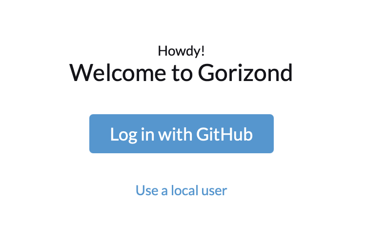
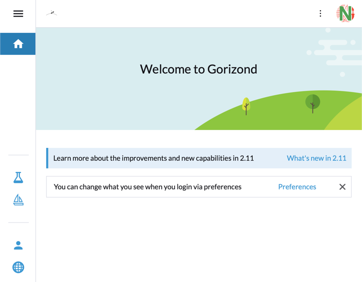
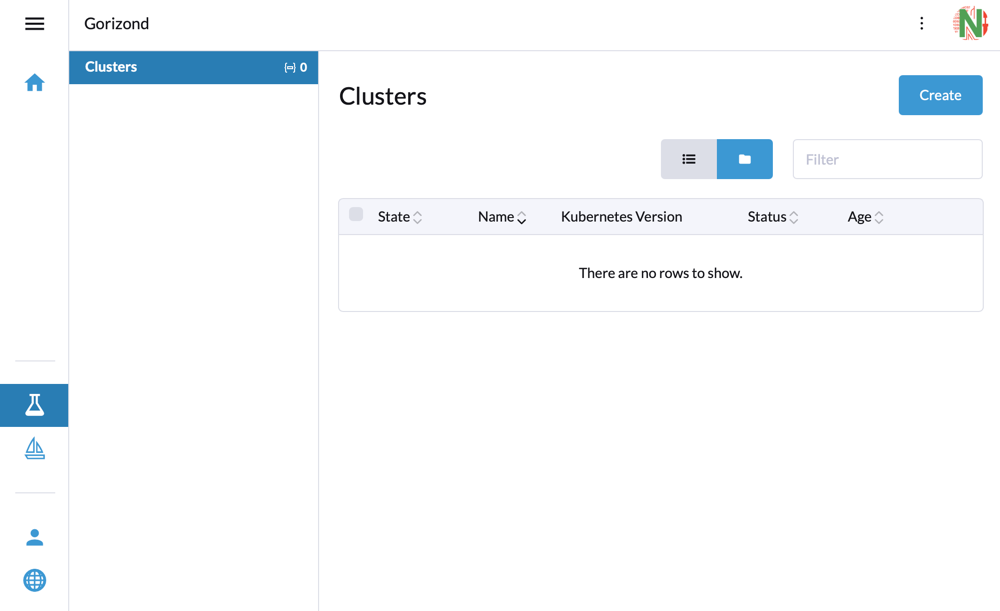
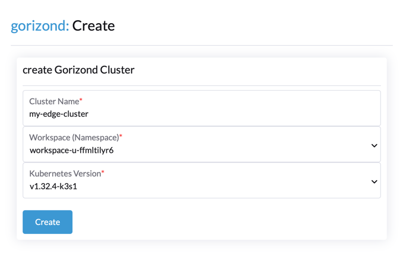
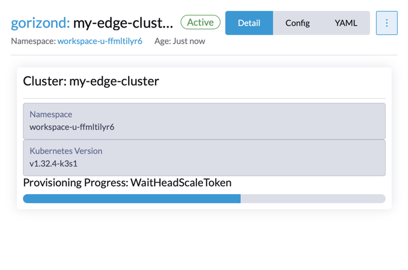
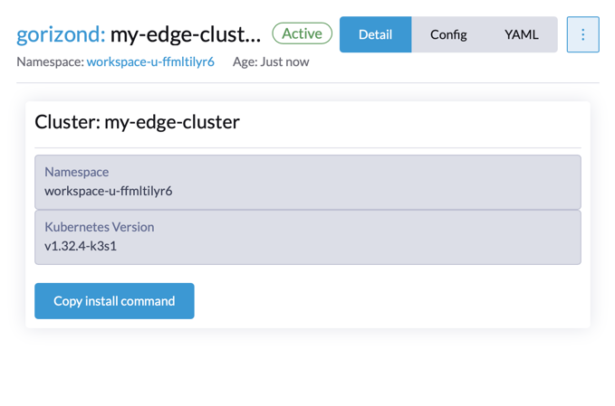
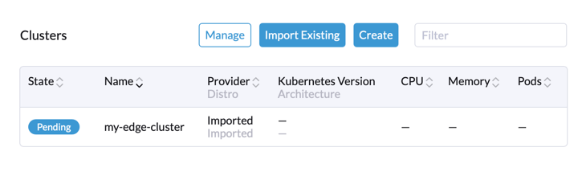
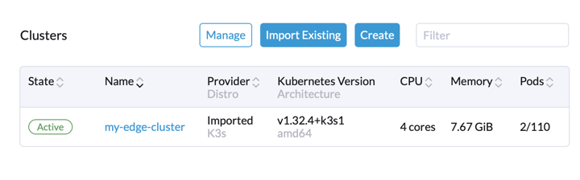

# Tutorial Intro

Let's discover **Gorizond in less than 5 minutes**. Gorizond create k3s api as service. Work with Rancher in k8s cluster. It's generate headscale and k3s api servers peer instance.

## What you'll need

- IoT device with internet access (Raspberry PI for example)

## Gorizond cluster usage

### Go to [gorizond](https://gorizond.negash.ru) and login with github

### After login you can see home page

### Go to [Gorizond](https://gorizond.negash.ru/dashboard/c/_/gorizond/provisioning.gorizond.io.cluster) cluster list

### Create you first [cluster](https://gorizond.negash.ru/dashboard/c/_/gorizond/provisioning.gorizond.io.cluster/create)
With workspace location and k3s version

### Wait cluster created
It will take about 3-4 minutes

### Copy and run command to you IoT/Server

:::tip Init Node

After running the command on the server or IoT device, the tailscale client will be installed and then k3s with the headscale settings will be installed, you need to wait until the cluster registers in rancher

:::

### Go to [gorizond](https://gorizond.negash.ru) home page and wait cluster ready

### Cluster ready to work with Fleet GitOps

