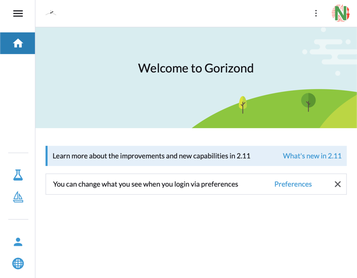
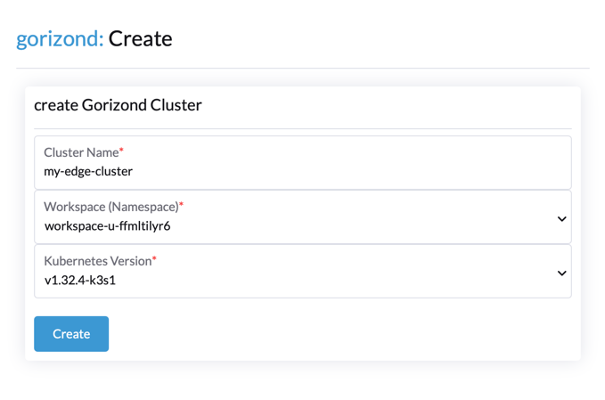
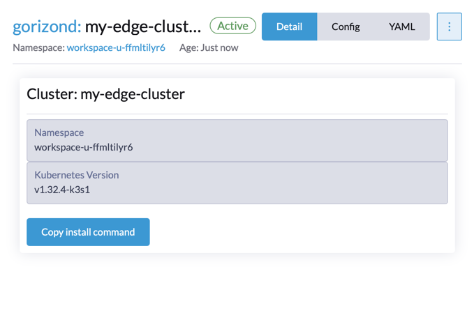
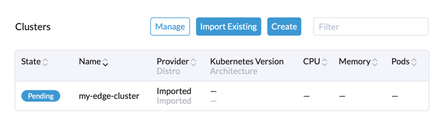

# Tutorial Intro

Познакомимся с **Gorizond меньше чем за 5 минут**. Gorizond поднимает k3s API как сервис, работает через Rancher в кластере k8s и создаёт пары инстансов headscale и k3s API серверов.

## Что понадобится

- IoT‑устройство с доступом в интернет (например, Raspberry Pi)

## Использование кластера Gorizond

### Зайдите на [gorizond](https://gorizond.negash.ru) и авторизуйтесь через GitHub

### После входа откроется домашняя страница

### Перейдите в список кластеров [Gorizond](https://gorizond.negash.ru/dashboard/c/_/gorizond/provisioning.gorizond.io.cluster)

### Создайте первый [кластер](https://gorizond.negash.ru/dashboard/c/_/gorizond/provisioning.gorizond.io.cluster/create)
Укажите регион workspace и версию k3s

### Дождитесь создания кластера
Обычно это занимает 3–4 минуты

### Скопируйте и выполните команду на IoT/сервере

:::tip Init Node

Команда ставит tailscale, затем k3s с настройками headscale. Подождите, пока кластер зарегистрируется в Rancher.

:::

### Вернитесь на [gorizond](https://gorizond.negash.ru) и дождитесь готовности кластера

### Кластер готов к работе с Fleet GitOps

